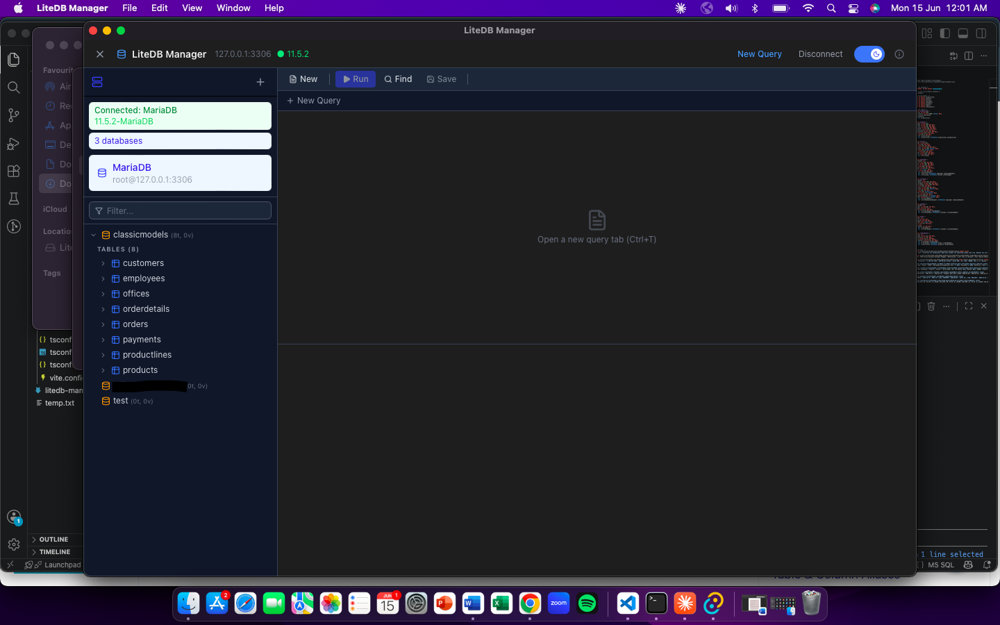

# LiteDB Manager

GUI ringan untuk MySQL / MariaDB / PostgreSQL. Dibangun dengan Tauri — native macOS, bukan Electron.

A lightweight GUI for MySQL / MariaDB / PostgreSQL. Built with Tauri — native macOS, not Electron.



---

## Fitur / Features

- Kelola banyak koneksi, password tersimpan di macOS Keychain — Manage multiple connections, passwords stored in macOS Keychain
- Schema browser — database, tabel, kolom, index, foreign key, view, trigger, sequence
- Query editor dengan syntax highlighting, autocomplete tabel/kolom, dan dark mode
- Query editor with syntax highlighting, table/column autocomplete, and dark mode
- `Ctrl+Enter` jalankan query (atau teks yang dipilih saja) — run query (or just selected text)
- `Ctrl+F` Find & Replace langsung di editor — Find & Replace inside the editor
- Export hasil query ke CSV atau JSON — Export query results to CSV or JSON
- Support MySQL, MariaDB, dan PostgreSQL

---

## Install

Download DMG lalu drag ke Applications:

Download the DMG and drag to Applications:

**[LiteDB Manager\_0.1.0\_x64.dmg](src-tauri/target/release/bundle/dmg/LiteDB%20Manager_0.1.0_x64.dmg)**

> Jika muncul peringatan "unidentified developer", klik kanan → Open.
>
> If macOS warns "unidentified developer", right-click → Open.

---

## Cara pakai / Usage

| Shortcut | Aksi / Action |
|---|---|
| `Ctrl+Enter` | Jalankan query / Run query |
| `Ctrl+Enter` (teks dipilih / with selection) | Jalankan teks dipilih saja / Run selection only |
| `Ctrl+Shift+Enter` | Jalankan semua / Run all |
| `Ctrl+T` | Tab baru / New tab |
| `Ctrl+W` | Tutup tab / Close tab |
| `Ctrl+F` | Cari & ganti / Find & replace |
| `Ctrl+S` | Simpan query / Save query |

**Koneksi pertama / First connection:**
1. Klik **+** di panel kiri → isi host, port, user, password
2. Pilih tipe: MySQL atau PostgreSQL
3. Klik **Test** untuk verifikasi, lalu **Save Connection**
4. Klik nama koneksi untuk terhubung

---

## Build dari source / Build from source

```bash
# Butuh: Node.js 20+, Rust 1.77+
# Requires: Node.js 20+, Rust 1.77+

npm install
npx tauri build
# Output: src-tauri/target/release/bundle/dmg/
```

---

## Stack

| | |
|---|---|
| Frontend | React 19, CodeMirror 6, Tailwind CSS 4 |
| Backend | Rust, sqlx 0.8, Tauri 2 |
| Storage | macOS Keychain (passwords), JSON (profiles) |
